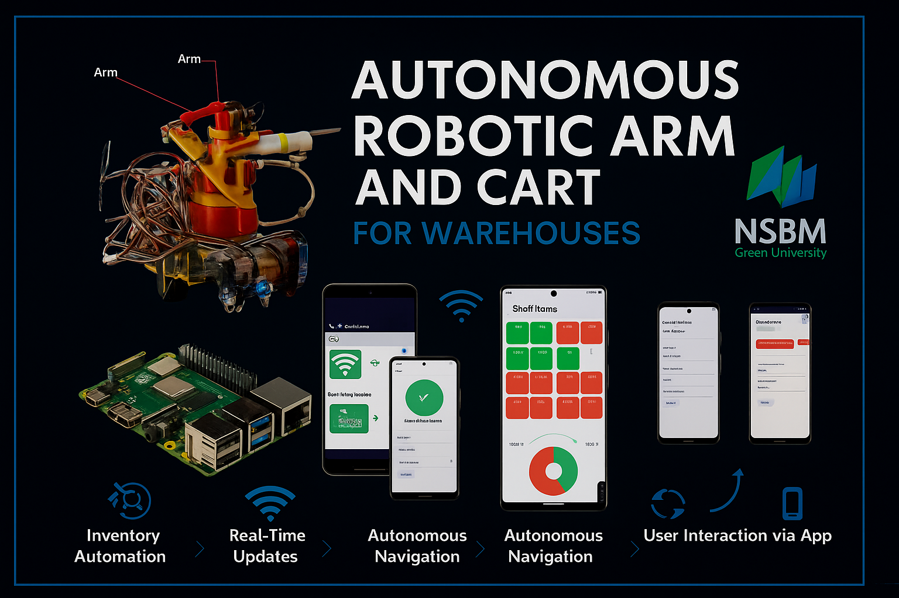

# 🦾 Autonomous Robotic Arm and Cart for Warehouses

An innovative IoT-based solution designed to automate warehouse operations using a robotic arm mounted on a mobile cart, integrated with a mobile application for real-time inventory control and smart logistics.

---

## 📌 Project Overview

The Autonomous Robotic Arm and Cart system aims to improve efficiency, accuracy, and scalability in warehouse inventory management. By combining robotics, sensors, and mobile technology, this system can autonomously pick, place, and track items throughout a warehouse with minimal human intervention.

---

## 🎯 Key Features

- 🤖 **Robotic Arm Control**
  - Picks and places items with precision using servo motors.
- 🛒 **Line-Following Cart**
  - Navigates predefined paths using infrared (IR) sensors.
- 🟢 **Color Recognition**
  - Determines drop-off/pick-up points via color sensor.
- 📱 **Mobile App Interface**
  - Real-time control and inventory monitoring.
- 🧠 **Raspberry Pi 4 Integration**
  - Acts as the central processing unit, controlling hardware logic.
- 📡 **Wi-Fi & MongoDB**
  - For seamless communication and cloud-based inventory tracking.

---

## 🔧 Technologies Used

### 🔌 Hardware:
- Raspberry Pi 4 Model B
- Servo Motors (6 DOF)
- IR Sensors
- Color Sensors
- Robotic Arm Kit
- Li-ion Rechargeable Battery

### 💻 Software:
- Python (for robot control)
- Dart/Flutter (for mobile application)
- MongoDB (for backend database)
- Flask-SocketIO (for real-time communication)

---

## 📲 Mobile Application Features

- ✅ Add/Update Supplier Details
- ✅ Real-time Inventory Monitoring
- ✅ Shelf Management (View filled/empty slots)
- ✅ Item Retrieval & Placement Control
- ✅ Weekly Expenses Tracking

---

## 🧪 System Workflow

1. User inputs item/supplier details via mobile app.
2. Data is sent to Raspberry Pi using Flask-SocketIO.
3. The robot determines shelf location and navigates.
4. Using color markers, the robot stops at the correct shelf.
5. Arm picks or places the item based on instructions.
6. Status updates are sent back to the app and MongoDB.

---

## 🛠️ System Components

- **Robotic Arm** – For object handling
- **IR Sensors** – For path detection
- **Color Sensors** – For position detection
- **Raspberry Pi** – For decision making and communication
- **Mobile Application** – For user input and monitoring

---

## 👥 Project Team

| Name                    |
|-------------------------|
| Charuka Hewa            | 
| Francis H Silva         |
| Mohotti Bhagya          | 
| Kankanige Ashan         |  
| Poruthotage Fernando    | 
| Walimunige Wanigarathne | 

---

## 🧠 Future Enhancements

- 📦 Machine Learning for optimized pathfinding
- 📍 Dynamic object tracking with vision systems
- 🛠️ Integration with warehouse ERP platforms
- ☁️ Cloud dashboard for advanced analytics

---

## 📂 Project Repositories

- 🔗 Mobile App: [GitHub - IOT-Mobile-App](https://github.com/charukad/IOT-Moblie-app.git)
- 🔗 Robot Code: [GitHub - IOT-Robot-Control](https://github.com/charukad/IOT-source-code.git)

---

## 🏫 Institution

**NSBM Green University**  
Faculty of Computing  
Module: PUSL2022 - Introduction to IoT  
Supervisors: Mr. Chaminda Attanayake, Mr. Isuru Sri Bandara

---

## 📽️ Project Demo

[🎥 View Demo Video](https://drive.google.com/file/d/12So7blcDo_zs4H_JWVEvqO3GP6IfVBkB/view?usp=sharing)

---
